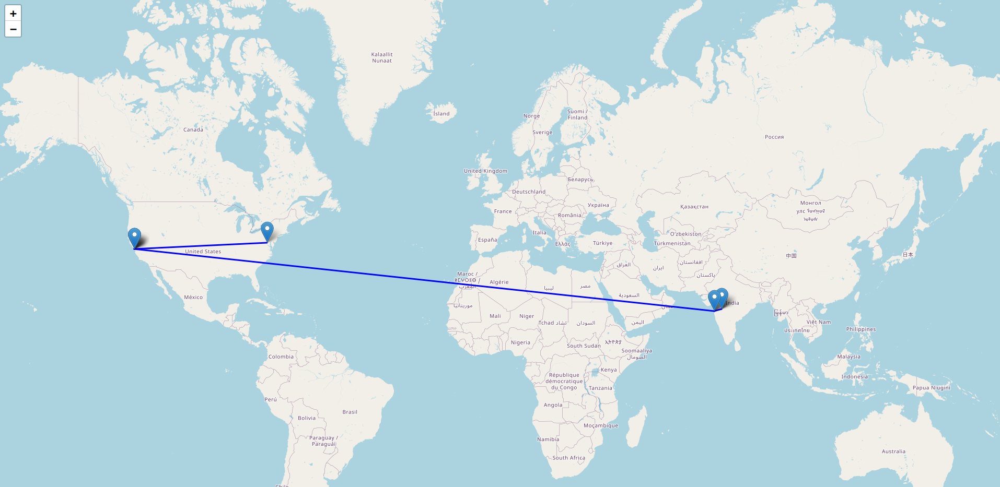

# Terminal geo_traceroute

CLI tool with built-in traceroute functionality with geolocation, service provider identification, trace map generation, etc.

Dependencies: `pip`, `folium`, `tabulate`

### Usage
```bash
> ./georoute.py -h
usage: georoute.py [-h] [-H HOST] [-v] [-j] [-s] [-m]

options:
  -h, --help            show this help message and exit
  -H HOST, --host HOST  Hostname or IP address to trace
  -v, --verbose         Enable verbose traceroute output mode
  -j, --jsonOutput      Enable JSON formatted output mode
  -s, --summary         Enable traceroute summary output mode
  -m, --mapGen          generate map for the traceroute
```

### Examples

```bash
> ./georoute.py -H 8.8.8.8 -s -m
Running traceroute... Done!
Trace Summary
+----------+----------------+---------------+---------------+
| Status   | IP Address     | Country       | City          |
+==========+================+===============+===============+
| fail     | 192.168.224.2  | private range | N/A           |
| fail     | 192.168.1.1    | private range | N/A           |
| fail     | 192.168.1.1    | private range | N/A           |
| success  | 45.112.251.81  | India         | Aurangabad    |
| success  | 45.112.251.81  | India         | Aurangabad    |
| fail     | 10.10.210.185  | private range | N/A           |
| fail     | 10.10.210.185  | private range | N/A           |
| success  | 103.49.243.202 | India         | Mumbai        |
| success  | 103.49.243.202 | India         | Mumbai        |
| success  | 72.14.238.215  | United States | Mountain View |
| success  | 72.14.238.215  | United States | Mountain View |
| success  | 74.125.253.165 | United States | Mountain View |
| success  | 74.125.253.165 | United States | Mountain View |
| success  | 8.8.8.8        | United States | Ashburn       |
+----------+----------------+---------------+---------------+
Map was generated in the current folder, and should open automatically in the default browser
```
Map:



### Upcoming
- Functionality to use traceroute/tracert inbuilt flags
- Adding flag to specify the output file for the map